# Báo Cáo Phân Tích Khám Phá Dữ Liệu (EDA)

## 1. Mô tả

Báo cáo này tổng hợp kết quả từ 3 notebook EDA chính:

- `2. Time_pattern_analysis.ipynb`: phân tích pattern theo thời gian.
- `3. Geo_pattern_analysis.ipynb`: phân tích pattern không gian.
- `4. Behavior_analysis.ipynb`: phân tích hành vi chuyến đi.

Tập dữ liệu sau làm sạch gồm **10,444,717 chuyến đi** và **20 cột** ở mức trip-level. Dữ liệu gốc là NYC Yellow Taxi Trip Data trong giai đoạn Q1/2026, chủ yếu từ **2026-01-01 đến 2026-04-01**.

Vì dữ liệu TLC không có `user_id` thật, EDA không được dùng trực tiếp để phân tích A/B test ở mức rider. Vai trò của EDA là hiểu cấu trúc chuyến đi thật, xác định pattern thời gian, không gian và hành vi, sau đó làm đầu vào cho bước tạo synthetic rider-level dataset.

---

## 2. Pattern theo thời gian

### 2.1 Phân bố theo giờ trong ngày

Số chuyến không phân bố đều trong 24 giờ. Nhu cầu giảm mạnh sau nửa đêm, chạm đáy vào rạng sáng, sau đó tăng nhanh từ buổi sáng và duy trì cao đến tối.

| Giờ pickup | Số chuyến |
|---:|---:|
| 18h | 693,124 |
| 17h | 657,691 |
| 21h | 644,676 |
| 19h | 636,615 |
| 20h | 636,450 |
| 4h | 88,921 |

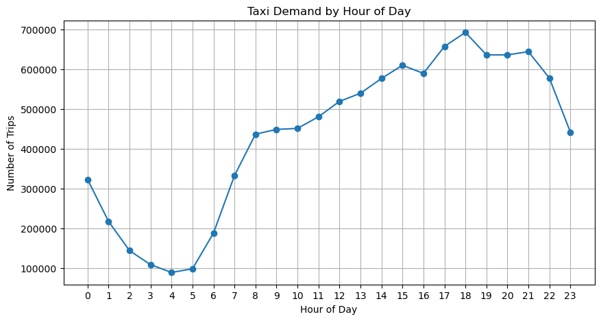

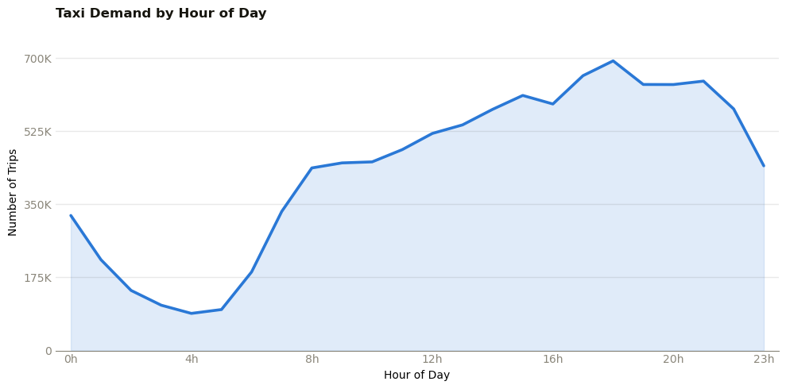

Kết quả chính:

- Giờ cao nhất là **18h** với **693,124 chuyến**.
- Giờ thấp nhất là **4h** với **88,921 chuyến**.
- Chênh lệch giữa giờ cao nhất và thấp nhất khoảng **7.8 lần**.
- Khung **17h-21h** duy trì nhu cầu rất cao, thể hiện peak chiều tối rõ hơn peak buổi sáng.

Nhóm commute:

| Period | Khoảng giờ | Số chuyến |
|---|---:|---:|
| Morning commute | 7-9 | 1,218,709 |
| Evening commute | 16-19 | 2,577,376 |
| Other | Các giờ còn lại | 6,648,632 |

Evening commute lớn hơn morning commute đáng kể, cho thấy nhu cầu di chuyển buổi chiều tối là một tín hiệu quan trọng khi tạo feature `pref_time_bucket`.

### 2.2 Pattern theo ngày trong tuần

Tổng số chuyến theo ngày:

| Ngày | Số chuyến |
|---|---:|
| Saturday | 1,719,637 |
| Thursday | 1,668,632 |
| Friday | 1,626,531 |
| Tuesday | 1,463,680 |
| Wednesday | 1,438,540 |
| Sunday | 1,349,159 |
| Monday | 1,178,538 |

Tổng theo day type:

| Day type | Tổng số chuyến | Trung bình chuyến/ngày |
|---|---:|---:|
| Weekday | 7,375,921 | 115,249 |
| Weekend | 3,068,796 | 118,031 |

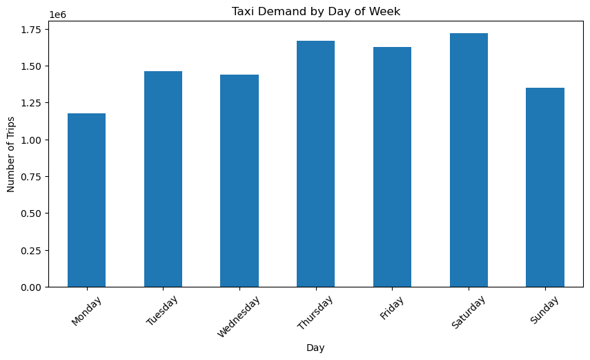

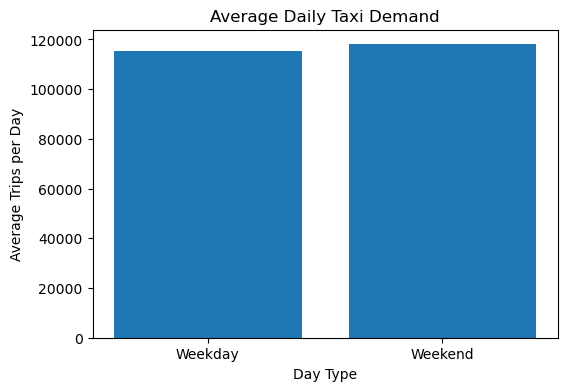

Nhận xét:

- Cuối tuần có trung bình **118,031 chuyến/ngày**, cao hơn ngày thường **115,249 chuyến/ngày**.
- Chênh lệch khoảng **2,782 chuyến/ngày**, tương đương **2.4%**.
- Thứ Bảy là ngày có nhu cầu cao nhất theo trung bình ngày, khoảng **132,280 chuyến/ngày**.
- Thứ Hai thấp nhất, khoảng **90,657 chuyến/ngày**; tuy nhiên kết quả này bị ảnh hưởng bởi các ngày thời tiết bất thường trong Q1/2026.

### 2.3 Weekday vs weekend theo giờ

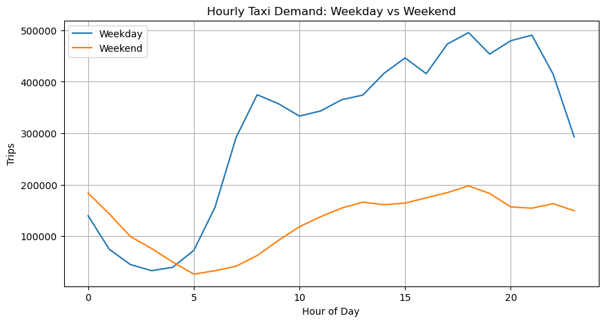

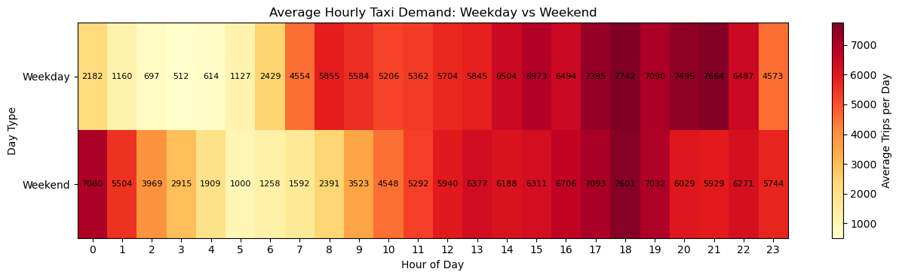

Khác biệt lớn nằm ở hình dạng phân bố:

- Weekday có cao điểm sáng rõ hơn, đặc biệt tăng mạnh từ 6h đến 8h.
- Weekend dịch chuyển về muộn hơn và có nhu cầu đêm khuya cao hơn.
- Khung 0h-4h cuối tuần cao hơn ngày thường rất nhiều, phù hợp với hành vi di chuyển sau các hoạt động giải trí.

### 2.4 Seasonal pattern và ngày bất thường

Trong giai đoạn tháng 1 đến tháng 3, dữ liệu không cho thấy xu hướng tăng/giảm dài hạn rõ rệt. Nhu cầu dao động theo ngày và có một số điểm giảm sâu.

Hai ngày bất thường:

| Ngày | Số chuyến | Z-score |
|---|---:|---:|
| 2026-01-25 | 43,407 | -3.6318 |
| 2026-02-23 | 22,733 | -4.6653 |

Các ngày lễ trong tập dữ liệu:

| Ngày | Số chuyến | Z-score | Holiday |
|---|---:|---:|---|
| 2026-01-01 | 106,592 | -0.4730 | True |
| 2026-01-19 | 93,074 | -1.1488 | True |
| 2026-02-16 | 80,567 | -1.7740 | True |

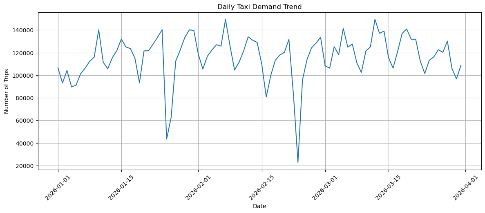

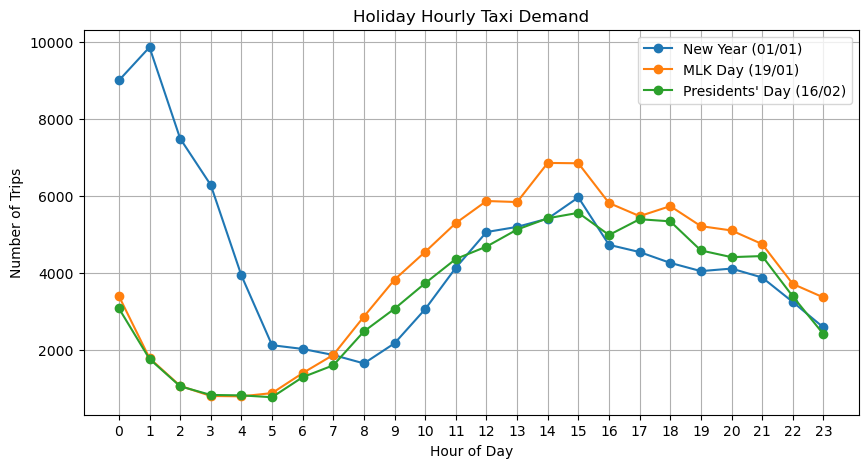

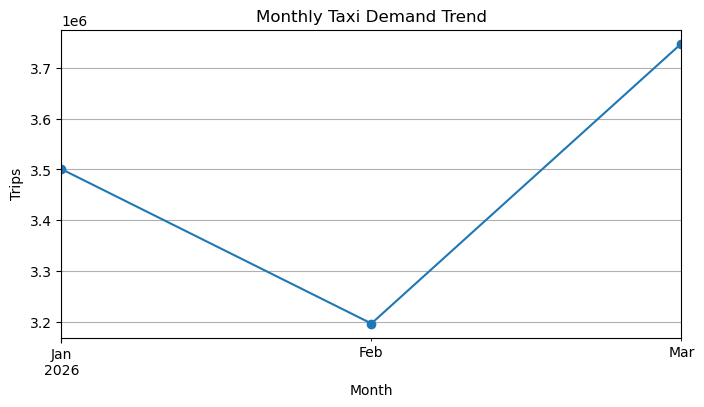

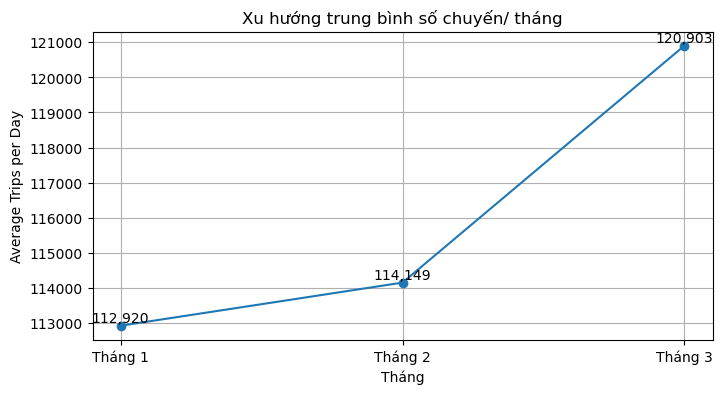

Hai điểm giảm sâu nhất liên quan đến điều kiện thời tiết cực đoan

---

## 3. Pattern không gian

### 3.1 Cấu trúc taxi zone

Bảng taxi zone lookup có **265 zone**:

| Service zone | Số zone |
|---|---:|
| Boro Zone | 205 |
| Yellow Zone | 55 |
| Airports | 2 |
| Unknown | 2 |
| EWR | 1 |

Theo borough:

| Borough | Số zone |
|---|---:|
| Queens | 69 |
| Manhattan | 69 |
| Brooklyn | 61 |
| Bronx | 43 |
| Staten Island | 20 |
| Unknown | 2 |
| EWR | 1 |

### 3.2 Pickup hotspots

Top pickup zone:

| Rank | Pickup zone | Borough | Số chuyến |
|---:|---|---|---:|
| 1 | Upper East Side South | Manhattan | 455,545 |
| 2 | Upper East Side North | Manhattan | 424,564 |
| 3 | Midtown Center | Manhattan | 424,343 |
| 4 | JFK Airport | Queens | 404,393 |
| 5 | Penn Station/Madison Sq West | Manhattan | 315,120 |
| 6 | Midtown East | Manhattan | 313,631 |
| 7 | Lincoln Square East | Manhattan | 300,270 |
| 8 | Times Sq/Theatre District | Manhattan | 295,879 |
| 9 | East Village | Manhattan | 285,827 |
| 10 | Union Sq | Manhattan | 272,286 |

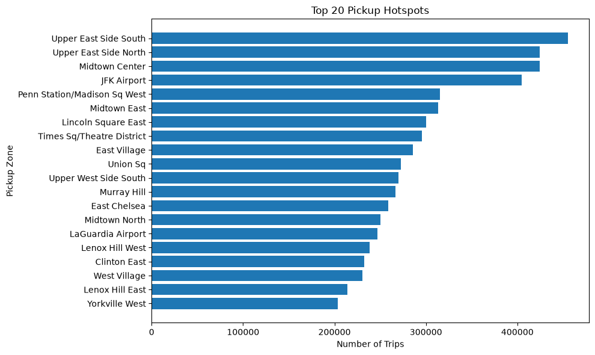

Nhận xét:

- Pickup tập trung mạnh tại Manhattan, đặc biệt quanh Upper East Side, Midtown, Penn Station, Times Square và Union Square.
- JFK Airport đứng thứ 4 về pickup, cho thấy sân bay là nguồn phát sinh chuyến lớn, dù tỷ lệ airport trip toàn cục không quá cao.

### 3.3 Dropoff hotspots

Top dropoff zone:

| Rank | Dropoff zone | Borough | Số chuyến |
|---:|---|---|---:|
| 1 | Upper East Side North | Manhattan | 439,978 |
| 2 | Upper East Side South | Manhattan | 414,474 |
| 3 | Midtown Center | Manhattan | 340,458 |
| 4 | Murray Hill | Manhattan | 286,049 |
| 5 | Upper West Side South | Manhattan | 272,956 |
| 6 | Lenox Hill West | Manhattan | 268,473 |
| 7 | Lincoln Square East | Manhattan | 267,765 |
| 8 | Times Sq/Theatre District | Manhattan | 267,654 |
| 9 | East Chelsea | Manhattan | 257,253 |
| 10 | Midtown East | Manhattan | 255,928 |

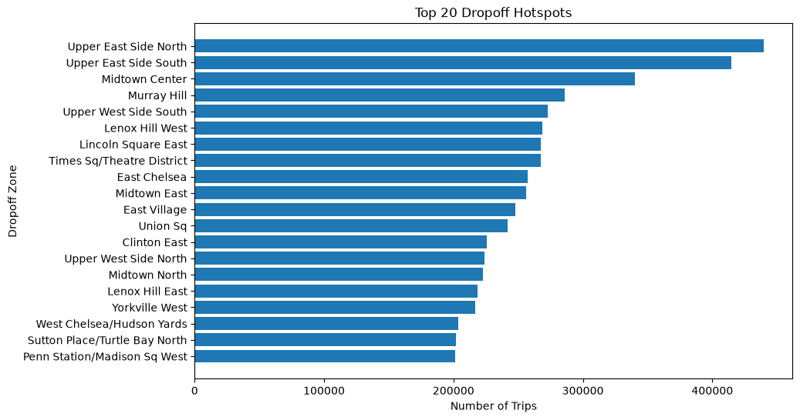

Nhận xét:

- Top 20 dropoff zone đều thuộc Manhattan.
- Manhattan là điểm đến chính của nhu cầu taxi, phù hợp với vai trò trung tâm văn phòng, thương mại, du lịch và khách sạn.

### 3.4 Origin-Destination flow

Top OD pair:

| Rank | Pickup zone | Dropoff zone | Số chuyến |
|---:|---|---|---:|
| 1 | Upper East Side South | Upper East Side North | 68,093 |
| 2 | Upper East Side North | Upper East Side South | 58,500 |
| 3 | Upper East Side North | Upper East Side North | 45,652 |
| 4 | Upper East Side South | Upper East Side South | 44,065 |
| 5 | Midtown Center | Upper East Side South | 29,789 |
| 6 | Upper East Side South | Midtown Center | 26,922 |
| 7 | Upper West Side South | Upper West Side North | 24,985 |
| 8 | Midtown Center | Upper East Side North | 24,935 |
| 9 | Lincoln Square East | Upper West Side South | 24,535 |
| 10 | Lenox Hill West | Upper East Side North | 23,497 |

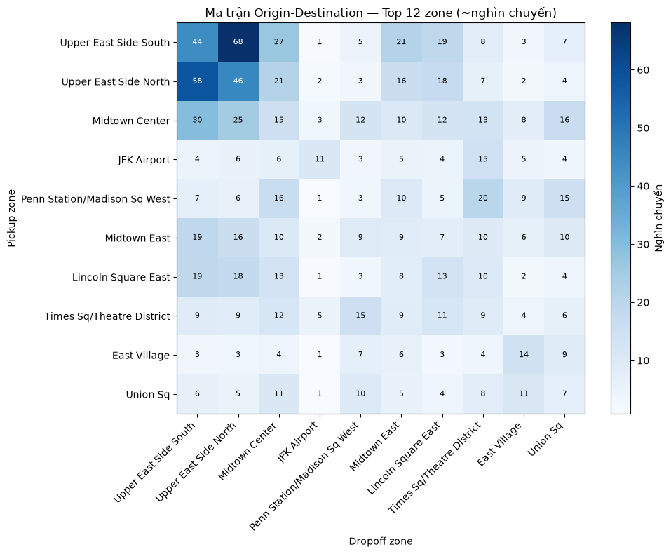

Kết luận:

- Các tuyến có lưu lượng lớn nhất nằm chủ yếu trong Manhattan.
- Upper East Side North và Upper East Side South tạo thành cụm OD nổi bật nhất.
- Midtown đóng vai trò như một hub kết nối quan trọng.
- Trong top 20 chỉ có một tuyến liên quan sân bay: **JFK Airport -> Outside of NYC** với **19,415 chuyến**, xếp thứ 19.

### 3.5 Airport trips

Tỷ lệ chuyến liên quan sân bay là **7.67%** tổng số chuyến. Tuy không chiếm đa số, nhóm này có hành vi rất khác biệt:

| Chỉ số | Airport | Non-airport |
|---|---:|---:|
| Average fare | 56.37 USD | 18.51 USD |
| Average total amount | 77.91 USD | 26.16 USD |
| Average distance | 13.07 miles | 2.68 miles |

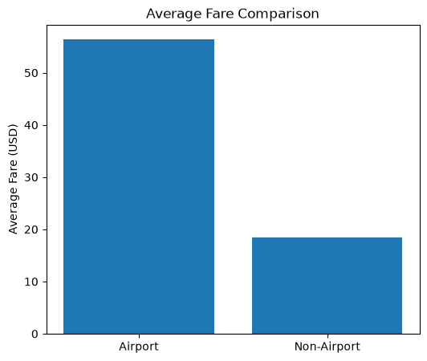

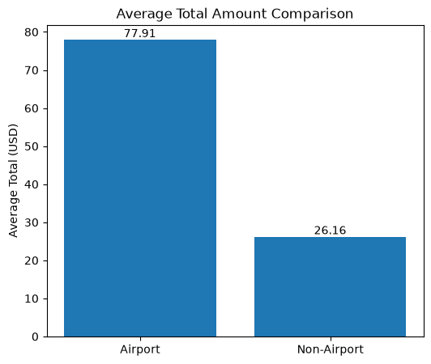

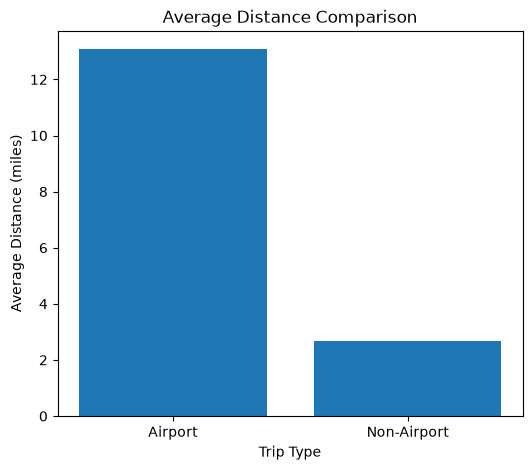

Nhận xét:

- Fare trung bình của chuyến sân bay cao gấp khoảng **3.05 lần** chuyến thường.
- Total amount trung bình cao gấp khoảng **2.98 lần**.
- Quãng đường trung bình cao gấp khoảng **4.87 lần**.
- `pct_airport` nên được giữ riêng khi tạo feature rider-level vì đây là tín hiệu mạnh về distance, fare và khả năng nhạy với promotion.

---

## 4. Hành vi chuyến đi

### 4.1 Trip distance

Thống kê `trip_distance`:

| Metric | Giá trị |
|---|---:|
| Mean | 3.48 miles |
| Std | 4.24 miles |
| Min | 0.01 miles |
| 25% | 1.09 miles |
| Median | 1.90 miles |
| 75% | 3.86 miles |
| Max | 99.58 miles |

Phân khúc theo quãng đường:

| Distance group | Số chuyến |
|---|---:|
| Short (<2 miles) | 5,505,243 |
| Medium (2-5 miles) | 2,938,053 |
| Long (5-10 miles) | 1,199,856 |
| Very Long (>10 miles) | 801,565 |

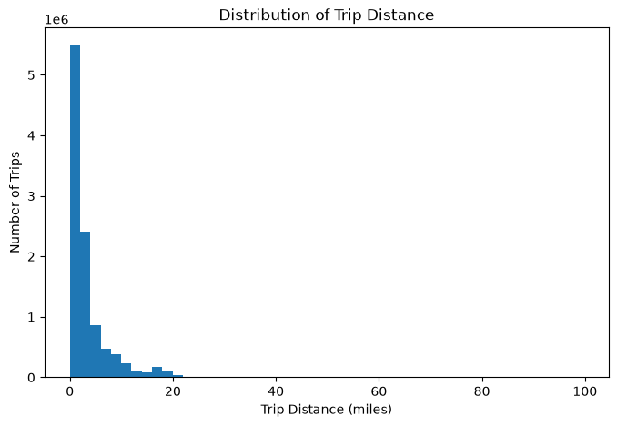

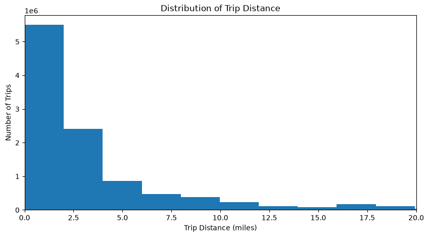

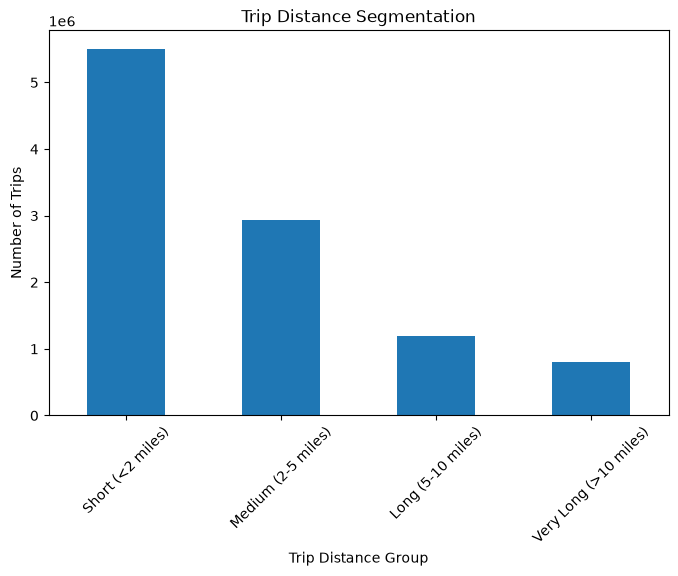

Kết luận:

- Đa số chuyến là chuyến ngắn, median chỉ **1.90 miles**.
- **75%** số chuyến không vượt quá **3.86 miles**.
- Càng đi xa, tần suất càng giảm nhanh; các chuyến dài thường liên quan đến sân bay hoặc khu ngoài trung tâm.

### 4.2 Fare analysis

| Chỉ số | Giá trị |
|---|---:|
| Average fare | 21.42 USD |
| Median fare | 15.60 USD |
| Fare per mile | 6.16 USD/mile |
| Median fare per mile | 7.66 USD/mile |

Fare trung bình cao hơn median, cho thấy phân phối fare lệch phải. Một nhóm nhỏ các chuyến dài, đặc biệt chuyến sân bay, kéo trung bình lên cao hơn mức chuyến đi điển hình.

### 4.3 Trip duration

Thống kê `duration_min`:

| Metric | Giá trị |
|---|---:|
| Mean | 17.43 phút |
| Std | 14.23 phút |
| Min | 0.02 phút |
| 25% | 8.42 phút |
| Median | 13.72 phút |
| 75% | 21.70 phút |
| Max | 299.90 phút |

Phân khúc theo thời lượng:

| Duration group | Số chuyến |
|---|---:|
| Short (5-15 min) | 4,850,773 |
| Medium (15-30 min) | 3,369,854 |
| Long (30-60 min) | 1,091,000 |
| Very Short (<5 min) | 915,744 |
| Very Long (>60 min) | 217,346 |

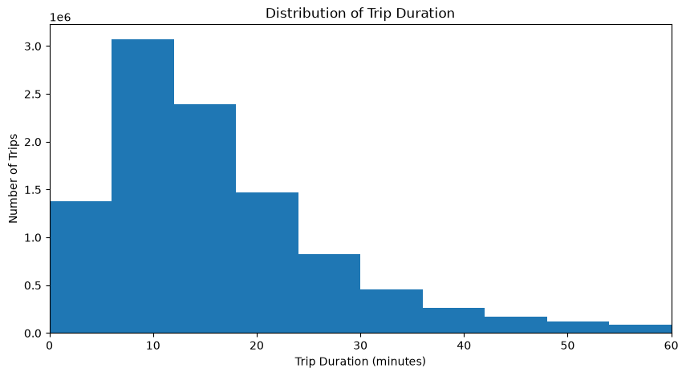

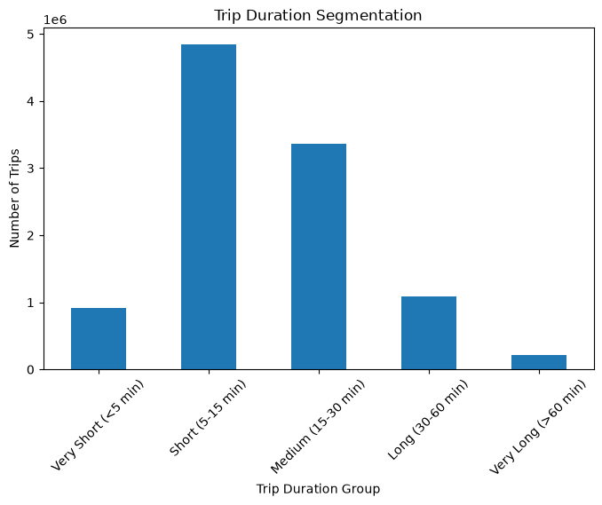

Nhận xét:

- Nhóm **5-15 phút** là phổ biến nhất, chiếm khoảng **46.4%** tổng số chuyến.
- Nhóm **15-30 phút** đứng thứ hai, chiếm khoảng **32.3%**.
- Các chuyến dưới 30 phút chiếm khoảng **87.5%** tổng số chuyến.
- Median duration chỉ **13.7 phút**, phù hợp với pattern taxi phục vụ các chuyến ngắn trong nội đô.

### 4.4 Route theo phân khúc quãng đường

Tuyến phổ biến theo nhóm distance:

| Distance group | Route nổi bật | Số chuyến |
|---|---|---:|
| Short (<2 mi) | Upper East Side South -> Upper East Side North | 67,597 |
| Short (<2 mi) | Upper East Side North -> Upper East Side South | 58,099 |
| Medium (2-5 mi) | Lincoln Square East -> Upper East Side North | 9,620 |
| Medium (2-5 mi) | Midtown Center -> Upper East Side North | 8,941 |
| Long (5-10 mi) | JFK Airport -> Flushing Meadows-Corona Park | 10,209 |
| Long (5-10 mi) | LaGuardia Airport -> Times Sq/Theatre District | 7,534 |
| Very Long (>10 mi) | JFK Airport -> Times Sq/Theatre District | 14,638 |
| Very Long (>10 mi) | JFK Airport -> Outside of NYC | 13,097 |

Kết luận:

- Chuyến ngắn và trung bình chủ yếu là di chuyển nội Manhattan.
- Chuyến dài và rất dài bắt đầu bị chi phối bởi route sân bay, đặc biệt JFK và LaGuardia.
- Điều này ủng hộ việc tạo các feature riêng như `typical_distance`, `route_entropy` và `pct_airport`.

---
