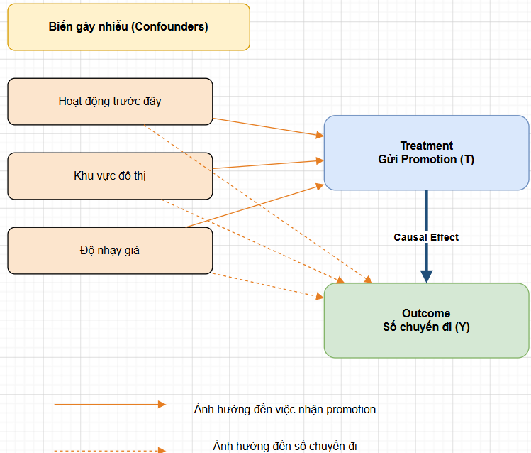

# Causal Thinking

## 1. Câu hỏi nhân quả (Causal question)

> “Việc gửi mã khuyến mãi (promotion) cho một người dùng có làm tăng số chuyến đi của chính người đó trong tháng tiếp theo hay không — và tăng bao nhiêu?”

## 2. Phân biệt ba khái niệm

| Khái niệm | Trả lời câu hỏi | Mục tiêu | Ví dụ |
|---|---|---|---|
| **Correlation** (tương quan) | X và Y có đi cùng nhau không? | Mô tả mối liên hệ | Người nhận promo thường có số chuyến cao hơn, nhưng chưa biết promo làm tăng số chuyến hay marketing vốn nhắm đến những người đã đi nhiều, hoặc cả hai cùng bị ảnh hưởng bởi một yếu tố khác. |
| **Prediction** (dự đoán) | Biết X, đoán Y có tốt hơn không? | Dự báo | Việc một người được nhận promo giúp mô hình dự đoán họ sẽ đi nhiều chuyến hơn, ngay cả khi promo không hề tạo ra tác động. |
| **Causal effect** (tác động nhân quả) | Nếu thay đổi X, Y đổi bao nhiêu? | Đánh giá tác động của hành động | Nếu gửi promo thay vì không gửi, số chuyến của cùng một nhóm người sẽ tăng thêm bao nhiêu, khi các yếu tố khác được giữ nguyên. |

## 3. Treatment và Outcome

- **Treatment (T):** người dùng có được gửi mã khuyến mãi trong kỳ hay không (T = 1: có gửi; T = 0: không gửi).
- **Outcome (Y):** số chuyến đi của người dùng đó trong 30 ngày sau đó.

## 4. Ba biến gây nhiễu (Confounders)

- **Mức độ hoạt động trước đây:** Marketing thường nhắm mã khuyến mãi vào người đã đi nhiều. Người đi nhiều trong quá khứ cũng có xu hướng đi nhiều trong tương lai.
- **Khu vực đô thị:** Người ở thành phố lớn được các chiến dịch nhắm nhiều hơn (thị trường trọng điểm), đồng thời có sẵn nhiều xe, quãng đường ngắn, thói quen dùng dịch vụ cao → đi nhiều chuyến hơn.
- **Mức độ nhạy giá:** Người nhạy giá dễ được nhắm mục tiêu bằng coupon hơn, và nhóm này phản ứng mạnh với giá (đi nhiều hơn khi rẻ, ít hơn khi giá thường) nên cũng có hành vi đặt chuyến khác biệt hơn nhóm thường.

## 5. Sơ đồ DAG

DAG (Directed Acyclic Graph) mô tả cấu trúc nhân quả.



## 6. Giải thích: naive treated vs. untreated comparison bị bias

Giả sử chỉ lấy **nhóm nhận promotion (treatment)** và **nhóm không nhận promotion (control)** rồi so sánh số chuyến trung bình:

```
Chênh lệch = E[Y | T=1] − E[Y | T=0]
```

Tuy nhiên, đại lượng này không nhất thiết bằng tác động nhân quả (causal effect) của promotion. Thay vào đó, nó bao gồm:

```
Tác động nhân quả thật  +  Thiên lệch chọn lọc (selection bias)
```

Thiên lệch xuất hiện vì hai nhóm vốn đã khác nhau ngay từ đầu, trước cả khi có promo:

- Nhóm nhận promo chứa nhiều người dùng hoạt động tích cực, người sống ở khu vực đô thị, hoặc người nhạy cảm với giá — vì đó chính là những người marketing nhắm tới.
- Nhưng chính những đặc điểm đó cũng tự làm họ đi nhiều chuyến hơn, ngay cả khi không có promo.

**Kết quả:** một phần chênh lệch quan sát được là do promo thật, một phần chỉ là vì đã phát promo cho đúng những người vốn dĩ đi nhiều.
